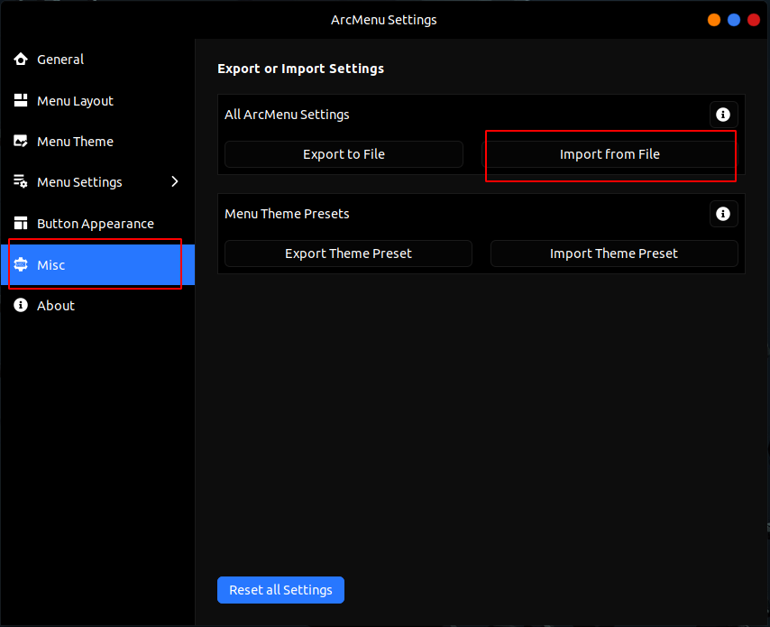
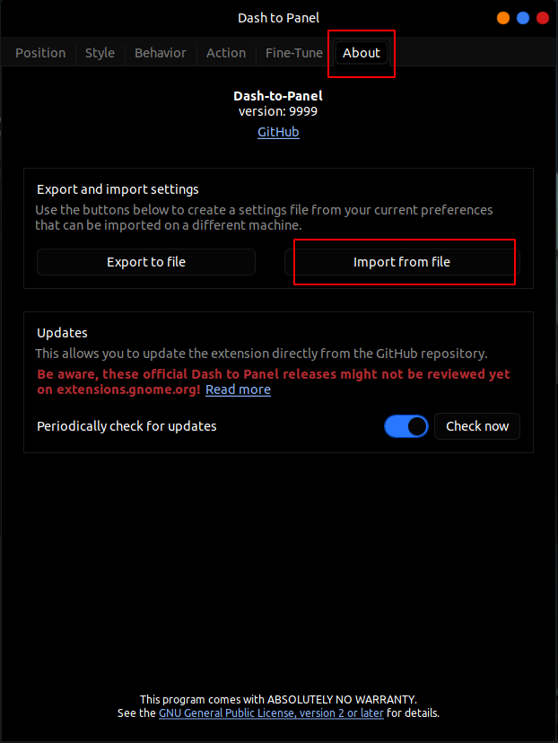
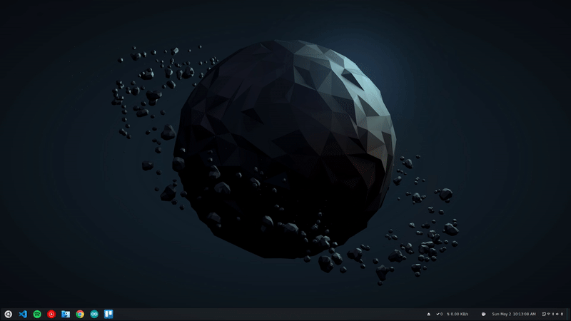

# 🔹️ Install and Apply theme

```bash

git clone https://github.com/Akash97p/myUbuntuConfig

cd myUbuntuConfig

bash mySysConf.sh --theme

```

The above script will install gnome tweaks and extensions.

# 🔹️Import Dash to panel and Arc menu config manualy 

## 🔸️Arc Menu



## 🔸️Dash to Panel



# End result

<a href ="https://www.reddit.com/r/Ubuntu/comments/n2zmhx/gnome_fish_byobu_arc_menu_dash_to_panel_a_bunch/">

</a>
